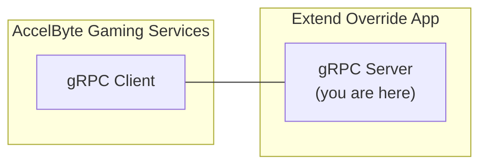

# matchmaking-function-grpc-plugin-server-python



`AccelByte Gaming Services` (AGS) features can be customized using 
`Extend Override` apps. An `Extend Override` app is a gRPC server which 
contains one or more custom functions which can be called by AGS 
instead of its default functions.

## Overview

This repository provides a project template to create an `Extend Override` 
app for `matchmaking function` written in `Python`. It includes an example of how the
custom functions can be implemented to match 2 players. It also includes the essential 
gRPC server authentication and authorization to ensure security. Additionally, 
it comes with built-in instrumentation for observability, ensuring that metrics, 
traces, and logs are available upon deployment.

You can clone this repository to begin developing your own `Extend Override` 
app for `matchmaking function`. Simply modify this project by implementing
your own logic for the custom functions.

## Prerequisites

1. Windows 11 WSL2 or Linux Ubuntu 22.04 or macOS 14+ with the following tools installed:

   a. Bash

      - On Windows WSL2 or Linux Ubuntu:

         ```
         bash --version

         GNU bash, version 5.1.16(1)-release (x86_64-pc-linux-gnu)
         ...
         ```

      - On macOS:

         ```
         bash --version

         GNU bash, version 3.2.57(1)-release (arm64-apple-darwin23)
         ...
         ```

   b. Make

      - On Windows WSL2 or Linux Ubuntu:

         To install from the Ubuntu repository, run `sudo apt update && sudo apt install make`.

         ```
         make --version

         GNU Make 4.3
         ...
         ```

      - On macOS:

         ```
         make --version

         GNU Make 3.81
         ...
         ```

   c. Docker (Docker Desktop 4.30+/Docker Engine v23.0+)
   
      - On Linux Ubuntu:

         1. To install from the Ubuntu repository, run `sudo apt update && sudo apt install docker.io docker-buildx docker-compose-v2`.
         2. Add your user to the `docker` group: `sudo usermod -aG docker $USER`.
         3. Log out and log back in to allow the changes to take effect.

      - On Windows or macOS:

         Follow Docker's documentation on installing the Docker Desktop on [Windows](https://docs.docker.com/desktop/install/windows-install/) or [macOS](https://docs.docker.com/desktop/install/mac-install/).

         ```
         docker version

         ...
         Server: Docker Desktop
            Engine:
            Version:          24.0.5
         ...
         ```

   d. Python 3.10

      - On Linux Ubuntu:

         To install from the Ubuntu repository, run `sudo apt update && sudo apt install python3 python3-venv`.

      - On Windows or macOS:

         Use the available installer [here](https://www.python.org/downloads/).

         ```
         python3 --version

         Python 3.10.12
         ```

   e. Curl

      - On Windows WSL2 or Linux Ubuntu:

         To install from the Ubuntu repository, run `sudo apt update && sudo apt install curl`.

         ```
         curl --version

         curl 7.81.0 (x86_64-pc-linux-gnu)
         ...
         ```

      - On macOS:

         ```
         curl --version

         curl 8.4.0 (x86_64-apple-darwin23.0) ...
         ...
         ```

   f. Jq

      - On Windows WSL2 or Linux Ubuntu:

         To install from the Ubuntu repository, run `sudo apt update && sudo apt install jq`.

         ```
         jq --version

         jq-1.6
         ...
         ```

      - On macOS:

         To install using Homebrew, run `brew install jq`.

         ```
         jq --version

         jq-1.7.1
         ```

   g. [Postman](https://www.postman.com/)

      - Use the available binary from [Postman](https://www.postman.com/downloads/).

   h. [ngrok](https://ngrok.com/)

      - Follow [ngrok's installation guide](https://ngrok.com/download).

   i. [extend-helper-cli](https://github.com/AccelByte/extend-helper-cli)

      - Use the available binary from [extend-helper-cli](https://github.com/AccelByte/extend-helper-cli/releases).

   > :exclamation: In macOS, you may use [Homebrew](https://brew.sh/) to easily install some of the tools above.

2. Access to `AccelByte Gaming Services` environment.

   a. Base URL
   
      - For `Shared Cloud` tier e.g.  https://spaceshooter.prod.gamingservices.accelbyte.io
      - For `Private Cloud` tier e.g.  https://dev.accelbyte.io
      
   b. [Create a Game Namespace](https://docs.accelbyte.io/gaming-services/tutorials/how-to/create-a-game-namespace/) if you don't have one yet. Keep the `Namespace ID`.

   c. [Create an OAuth Client](https://docs.accelbyte.io/gaming-services/services/access/authorization/manage-access-control-for-applications/#create-an-iam-client) with confidential client type with the following permission. Keep the `Client ID` and `Client Secret`.

## Setup

To be able to run this app, you will need to follow these setup steps.

1. Create a docker compose `.env` file by copying the content of [.env.template](.env.template) file.

   > :warning: **The host OS environment variables have higher precedence compared to `.env` file variables**: If the variables in `.env` file do not seem to take effect properly, check if there are host OS environment variables with the same name. 
   See documentation about [docker compose environment variables precedence](https://docs.docker.com/compose/environment-variables/envvars-precedence/) for more details.

2. Fill in the required environment variables in `.env` file as shown below.

   ```
   AB_BASE_URL=https://test.accelbyte.io     # Base URL of AccelByte Gaming Services environment
   AB_CLIENT_ID='xxxxxxxxxx'                 # Client ID from the Prerequisites section
   AB_CLIENT_SECRET='xxxxxxxxxx'             # Client Secret from the Prerequisites section
   AB_NAMESPACE='xxxxxxxxxx'                 # Namespace ID from the Prerequisites section
   PLUGIN_GRPC_SERVER_AUTH_ENABLED=true      # Enable or disable access token validation
   ```

   > :exclamation: **In this app, PLUGIN_GRPC_SERVER_AUTH_ENABLED is `true` by default**: If it is set to `false`, the gRPC server can be invoked without an AGS access 
   token. This option is provided for development purpose only. It is 
   recommended to enable `gRPC server` access token validation in production 
   environment.

## Building

To build this app, use the following command.

```shell
make build
```

The build output will be available in `.output` directory.

## Running

To (build and) run this app in a container, use the following command.

```shell
docker compose up --build
```

## Testing

### Test in Local Development Environment

> :warning: **To perform the following, make sure PLUGIN_GRPC_SERVER_AUTH_ENABLED is set to `false`**: Otherwise,
the gRPC request will be rejected by the `gRPC server`.

This app can be tested locally using [postman](https://www.postman.com/).

1. Run this app by using the command below.

   ```shell
   docker compose up --build
   ```

2. Open `postman`, create a new `gRPC request`, and enter `localhost:6565` as server URL (see tutorial [here](https://blog.postman.com/postman-now-supports-grpc/)).

   > :warning: **If you are running [grpc-plugin-dependencies](https://github.com/AccelByte/grpc-plugin-dependencies) stack alongside this project as mentioned in [Test Observability](#test-observability)**: Use `localhost:10000` instead of `localhost:6565`. This way, the `gRPC server` will be called via `Envoy` service within `grpc-plugin-dependencies` stack instead of directly.

3. Continue by selecting `MakeMatches` grpc stream method and click `Invoke` button. This will start stream connection to the`gRPC server`.


4. Proceed by sending parameters first to specify number of players in a match by copying sample `json` below and click `Send`.

   ```json
   {
       "parameters": {
           "rules": {
               "json": "{\"shipCountMin\":2, \"shipCountMax\":2}"
           }
       }
   }
   ```

5. Now we can send match ticket to start matchmaking by copying sample `json` below and replace it into `postman` message then click `Send`.

   ```json
   {
       "ticket": {
           "players": [
               {
                   "player_id": "playerA"
               }
           ]
       }
   }
   ```

6. You can do step *5* multiple times until the number of players is met and a match can be created. In this case, it is 2 players.

7. If successful, you will receive responses (down stream) in `postman` that looks like the following.

   ```json
   {
       "match": {
           "tickets": [],
           "teams": [
               {
                   "user_ids": [
                       "playerA",
                       "playerB"
                   ]
               }
           ],
           "region_preferences": [
               "us-east-2", 
               "us-west-2"
           ],
           "match_attributes": null
       }
   }
   ```


### Test with AccelByte Gaming Services

For testing this app which is running locally with AGS, the gRPC server 
needs to be exposed to the internet. To do this without requiring public IP, we 
can use something like [ngrok](https://ngrok.com/).

1. Run this app by using command below.

   ```shell
   docker compose up --build
   ```

2. Sign-in/sign-up to [ngrok](https://ngrok.com/) and get your auth token in `ngrok` dashboard.

3. In this app root directory, run the following helper command to expose `gRPC server` port in local development environment to the internet. Take a note of the `ngrok` forwarding URL e.g. `http://0.tcp.ap.ngrok.io:xxxxx`.

   ```
   make ngrok NGROK_AUTHTOKEN=xxxxxxxxxxx
   ```

   > :warning: **If you are running [grpc-plugin-dependencies](https://github.com/AccelByte/grpc-plugin-dependencies) stack alongside this app as mentioned in [Test Observability](#test-observability)**: Run the above 
   command in `grpc-plugin-dependencies` directory instead of this app directory.

4. [Create an OAuth Client](https://docs.accelbyte.io/guides/access/iam-client.html) with `confidential` client type with the following permissions. Keep the `Client ID` and `Client Secret`.
   
   - For AGS Private Cloud customers:
      - `NAMESPACE:{namespace}:MATCHMAKING:RULES [CREATE,READ,UPDATE,DELETE]`
      - `NAMESPACE:{namespace}:MATCHMAKING:FUNCTIONS [CREATE,READ,UPDATE,DELETE]`
      - `NAMESPACE:{namespace}:MATCHMAKING:POOL [CREATE,READ,UPDATE,DELETE]`
      - `NAMESPACE:{namespace}:MATCHMAKING:TICKET [CREATE,READ,UPDATE,DELETE]`
      - `ADMIN:NAMESPACE:{namespace}:INFORMATION:USER:* [CREATE,READ,UPDATE,DELETE]`
      - `ADMIN:NAMESPACE:{namespace}:SESSION:CONFIGURATION:* [CREATE,READ,UPDATE,DELETE]`
   - For AGS Shared Cloud customers:
      - Matchmaking -> Rule Sets (Create, Read, Update, Delete)
      - Matchmaking -> Match Functions (Create, Read, Update, Delete)
      - Matchmaking -> Match Pools (Create, Read, Update, Delete)
      - Matchmaking -> Match Tickets (Create, Read, Update, Delete)
      - IAM -> Users (Create, Read, Update, Delete)
      - Session -> Configuration Template (Create, Read, Update, Delete)

   > :warning: **Oauth Client created in this step is different from the one from Prerequisites section:** It is required by [demo.sh](demo.sh) script in the next step to register the `gRPC Server` URL and also to create and delete test users.
   
5. Run the [demo.sh](demo.sh) script to simulate the matchmaking flow which calls this app using the `Client ID` and `Client Secret` created in the previous step. Pay attention to this app console log when matchmaking flow is running. The `gRPC Server` methods should get called when creating match tickets and it should group players in twos.

   ```
   export AB_BASE_URL='https://test.accelbyte.io'
   export AB_CLIENT_ID='xxxxxxxxxx'         # Use Client ID from the previous step
   export AB_CLIENT_SECRET='xxxxxxxxxx'     # Use Client Secret from the previous step    
   export AB_NAMESPACE='accelbyte'          # Use your Namespace ID
   export GRPC_SERVER_URL='http://0.tcp.ap.ngrok.io:xxxxx'  # Use your ngrok forwarding URL
   bash demo.sh
   ```

   > :warning: **Make sure demo.sh has Unix line-endings (LF)**: If this repository was cloned in Windows for example, the `demo.sh` may have Windows line-endings (CRLF) instead. In this case, use tools like `dos2unix` to change the line-endings to Unix (LF).
   Invalid line-endings may cause errors such as `demo.sh: line 2: $'\r': command not found`.
 
> :warning: **Ngrok free plan has some limitations**: You may want to use paid plan if the traffic is high.

### Test Observability

To be able to see the how the observability works in this app locally, there are few things that need be setup before performing tests.

1. Uncomment loki logging driver in [docker-compose.yaml](docker-compose.yaml)

   ```
    # logging:
    #   driver: loki
    #   options:
    #     loki-url: http://host.docker.internal:3100/loki/api/v1/push
    #     mode: non-blocking
    #     max-buffer-size: 4m
    #     loki-retries: "3"
   ```

   > :warning: **Make sure to install docker loki plugin beforehand**: Otherwise,
   this project will not be able to run. This is required so that container logs
   can flow to the `loki` service within `grpc-plugin-dependencies` stack. 
   Use this command to install docker loki plugin: `docker plugin install grafana/loki-docker-driver:latest --alias loki --grant-all-permissions`.

2. Clone and run [grpc-plugin-dependencies](https://github.com/AccelByte/grpc-plugin-dependencies) stack alongside this project. After this, Grafana 
will be accessible at http://localhost:3000.

   ```
   git clone https://github.com/AccelByte/grpc-plugin-dependencies.git
   cd grpc-plugin-dependencies
   docker-compose up
   ```

   > :exclamation: More information about [grpc-plugin-dependencies](https://github.com/AccelByte/grpc-plugin-dependencies) is available [here](https://github.com/AccelByte/grpc-plugin-dependencies/blob/main/README.md).

3. Perform testing. For example, by following [Test in Local Development Environment](#test-in-local-development-environment) or [Test with AccelByte Gaming Services](#test-with-accelbyte-gaming-services).

## Deploying

After done testing, you may want to deploy this app to `AccelByte Gaming Services`.

1. [Create a new Extend Override App on Admin Portal](https://docs.accelbyte.io/gaming-services/services/extend/override-ags-feature/getting-started-with-matchmaking-customization/#create-an-extend-app). Keep the `Repository URI`.

2. Download and setup [extend-helper-cli](https://github.com/AccelByte/extend-helper-cli/) (only if it has not been done previously).

3. Perform docker login with `extend-helper-cli` using the following command.

   ```
   extend-helper-cli dockerlogin --namespace <my-game> --app <my-app> --login
   ```

   > :exclamation: For your convenience, the above `extend-helper-cli` command can also be 
   copied from `Repository Authentication Command` under the corresponding app detail page.
   
4. Build and push this project docker image to AccelByte ECR using the following command.
   
   ```
   extend-helper-cli image-upload --work-dir <my-project-dir> --namespace <my-game> --app <my-app> --image-tag v0.0.1
   ```

   > :warning: Make sure to perform docker login (step 3) before executing the above command.

5. Open Admin Portal, go to **Extend** -> **Overridable Features**. And then select the extend app.

6. To deploy selected image tag, click **Image Version History** and select 
   desired image tag to be deployed.

7. Click **Deploy Image**, confirm the deployment and go back to App Detail by 
   clicking **Cancel**.

8. Wait until app status is running.

## Next Step

Proceed to modify this project template and implement your own custom functions.

## Additional

### Helper Commands

Helper commands to make development easier.

```
make venv       # Setting up virtual environment
make build      # Generating code from proto files
make test       # Running tests
make run        # Running the server (without container)
```

For more details about the command, see [Makefile](Makefile).

### Environment Variables

| Environment Variable           | Description                                                                         | Default                                  |
|--------------------------------|-------------------------------------------------------------------------------------|------------------------------------------|
| APP_NAME                       | Used as the service name and the User-Agent for AccelByte endpoints.                | `app-server`                             |
| AB_BASE_URL                    | AccelByte HTTP base url.                                                            | `https://test.accelbyte.io`              |
| AB_CLIENT_ID                   | AccelByte Username for HTTP basic auth.                                             |                                          |
| AB_CLIENT_SECRET               | AccelByte Password for HTTP basic auth.                                             |                                          |
| AB_NAMESPACE                   |                                                                                     | `accelbyte`                              |
| PLUGIN_GRPC_SERVER_AUTH_ENABLED|                                                                                     | `true`                                   |
| ENABLE_INTERCEPTOR_LOGGING     |                                                                                     | `false`                                  |
| ENABLE_INTERCEPTOR_METRICS     |                                                                                     | `true`                                   |
| ENABLE_PROMETHEUS              |                                                                                     | `true`                                   |
| ENABLE_ZIPKIN                  |                                                                                     | `true`                                   |
| OTEL_EXPORTER_ZIPKIN_ENDPOINT  | Endpoint for Zipkin traces.                                                         | `http://localhost:9411/api/v2/spans`     |
| OTEL_EXPORTER_ZIPKIN_TIMEOUT   | Maximum time (in milliseconds) the Zipkin exporter will wait for each batch export. | `10000`                                  |
| PROMETHEUS_ADDR                | Prometheus HTTP server address.                                                     | `0.0.0.0`                                |
| PROMETHEUS_PORT                | Prometheus HTTP server port.                                                        | `8080`                                   |
| PROMETHEUS_ENDPOINT            | Prometheus endpoint.                                                                | `/metrics`                               |
| PROMETHEUS_PREFIX              | Prometheus prefix.                                                                  | `$(camelcase APP_NAME)`                  |
| TOKEN_VALIDATOR_FETCH_INTERVAL | How often to refetch the JWKS, Revocation List, and Role List (in seconds).         | `3600`                                   |

### Useful Links

- [OpenTelemetry  > Instrumentation > Python](https://opentelemetry.io/docs/instrumentation/python)
- [Prometheus > Best Practices > Metric and Label Naming](https://prometheus.io/docs/practices/naming)
