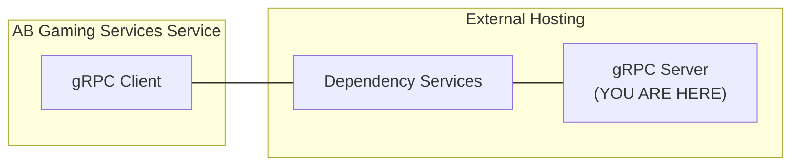

# matchmaking-function-grpc-plugin-server-python

This repository contains `gRPC server` sample app (Python) for AccelByte Gaming Services service `matchmaking function` customization.

The `gRPC server` is a part of AccelByte Gaming Services service customization gRPC plugin architecture.



`AccelByte Gaming Services` capabilities can be extended using custom functions implemented in a `gRPC server`.
If configured, custom functions in the `gRPC server` will be called by `AccelByte Gaming Services` instead of the default function.
The `gRPC server` and the `gRPC client` can actually communicate directly.
However, additional services are necessary to provide **security**, **reliability**, **scalability**, and **observability**. 
We call these services as `dependency services`.
The [grpc-plugin-dependencies](https://github.com/AccelByte/grpc-plugin-dependencies) repository is provided as an example of what these `dependency services` may look like. 
It contains a docker compose which consists of these `dependency services`.

> :warning: **If you are new to AccelByte Gaming Services service customization gRPC plugin architecture**: You may want to read `OVERVIEW.md` in the `grpc-plugin-dependencies` repository to get the overview of the architecture.

## Overview

This repository contains `sample matchmaking function gRPC server app` written in `Python`,
it provides simple custom matchmaking function implementation for matchmaking service in AccelByte Gaming Services. 
It will simply match 2 or any configured number of players coming into the function.

This sample app also shows how this `gRPC server` can be instrumented for better observability.
It is configured by default to send metrics, traces, and logs to the observability `dependency services` 
in [grpc-plugin-dependencies](https://github.com/AccelByte/grpc-plugin-dependencies).

## Prerequisites

1. Windows 10 WSL2 or Linux Ubuntu 20.04 with the following tools installed.

   a. bash

   b. make

   c. docker

   d. docker-compose v2

   e. docker loki driver
    
      docker plugin install grafana/loki-docker-driver:latest --alias loki --grant-all-permissions

   f. python 3.9+

2. AccelByte Gaming Services demo environment.

   a. Base URL: https://demo.accelbyte.io.

   b. [Create a Game Namespace](https://docs.accelbyte.io/esg/uam/namespaces.html#tutorials) if you don't have one yet. Keep the `Namespace ID`.

   c. [Create an OAuth Client](https://docs.accelbyte.io/guides/access/iam-client.html) with confidential client type with the following permission. Keep the `Client ID` and `Client Secret`.

      - NAMESPACE:{namespace}:MMV2GRPCSERVICE - READ

## Setup

Create a docker compose `.env` file based on `.env.template` file and fill in the required environment variables in `.env` file.

```
AB_BASE_URL=https://demo.accelbyte.io     # Base URL
AB_CLIENT_ID=xxxxxxxxxx                   # Client ID
AB_CLIENT_SECRET=xxxxxxxxxx               # Client Secret
AB_NAMESPACE=xxxxxxxxxx                   # Namespace ID
PLUGIN_GRPC_SERVER_AUTH_ENABLED=false     # Enable or disable access token and permission check
```

> :exclamation: **For the server and client**: Use the same Base URL, Client ID, Client Secret, and Namespace ID.

## Developing

Helper commands to make development easier.

```
make setup      # Setting up virtual environment
make build      # Generating code from proto files
make test       # Running tests
make run        # Running the server (without container)
```

For more details about the command, see [Makefile](Makefile).

## Building

To build the application, use the following command.

```
make build
```

To build and create a docker image of the application, use the following command.

```
make image
```

For more details about the command, see [Makefile](Makefile).

## Running

To run the docker image of the application which has been created beforehand, use the following command.

```
docker-compose up
```

OR

To build, create a docker image, and run the application in one go, use the following command.

```
docker-compose up --build
```

## Testing

### Test Functionality in Local Development Environment

The functionality of `gRPC server` methods can be tested in local development environment.

1. Start the `dependency services` by following the `README.md` in the [grpc-plugin-dependencies](https://github.com/AccelByte/grpc-plugin-dependencies) repository.

2. Start this `gRPC server` sample app by using command below.

   ```shell
   docker-compose up --build
   ```
   
3. Open `postman`, create a new `gRPC request`, and enter `localhost:10000` as server URL. 

   > :exclamation: We are essentially accessing the `gRPC server` through an `Envoy` proxy which is a part of `dependency services`.

4. In `postman`, continue by selecting `MakeMatches` grpc stream method and click `Invoke` button, this will start stream connection to grpc server sample app.

5. In `postman`, continue sending parameters first to specify number of players in a match by copying sample `json` below and click `Send`.

   ```json
   {
       "parameters": {
           "rules": {
               "json": "{\"shipCountMin\":2, \"shipCountMax\":2}"
           }
       }
   }
   ```
   
6. Still In `postman`, now we can send match ticket to start matchmaking by copying sample `json` below and replace it into `postman` message then click `Send`

   ```json
   {
       "ticket": {
           "players": [
               {
                   "player_id": "playerA"
               }
           ]
       }
   }
   ```
   
7. You can do step *6* multiple times until the number of player met and find matches, in our case it is 2 players.

8. If successful, you will receive response (down stream) in `postman` similir to `json` sample below

   ```json
   {
       "match": {
           "tickets": [],
           "teams": [
               {
                   "user_ids": [
                       "playerA",
                       "playerB"
                   ]
               }
           ],
           "region_preferences": [
               "any"
           ],
           "match_attributes": null
       }
   }
   ```

> :exclamation: **Sample `gRPC server` and `gRPC client` does not have to be implemented in the same programming language
> **: As long as the gRPC proto is compatible, they should be able to communicate with each other.

### Test Integration with AccelByte Gaming Services

After testing functionality in local development environment,
to allow the actual `gRPC client` in AccelByte Gaming Services demo environment to access `gRPC server` in
local development environment without requiring a public IP address, we can use [ngrok](https://ngrok.com/).

1. Start the `dependency services` by following the `README.md` in the [grpc-plugin-dependencies](https://github.com/AccelByte/grpc-plugin-dependencies) repository.

2. Start this `gRPC server` sample app by using command below.

   ```shell
   docker-compose up
   ```
   
3. Sign-in/sign-up to [ngrok](https://ngrok.com/) and get your auth token in `ngrok` dashboard.

4. In `grpc-plugin-dependencies` repository, run the following command to expose `gRPC server` Envoy proxy port in local development environment to the internet. Take a note of the `ngrok` forwarding URL e.g. `tcp://0.tcp.ap.ngrok.io:xxxxx`.

   ```
   make ngrok NGROK_AUTHTOKEN=xxxxxxxxxxx
   ```

5. [Create an OAuth Client](https://docs.accelbyte.io/guides/access/iam-client.html) with confidential client type with the following permissions. Keep the `Client ID` and `Client Secret` for running the [demo.sh](demo.sh) script after this.

   - NAMESPACE:{namespace}:MATCHMAKING:RULES - CREATE, READ, UPDATE, DELETE
   - NAMESPACE:{namespace}:MATCHMAKING:FUNCTIONS - CREATE, READ, UPDATE, DELETE
   - NAMESPACE:{namespace}:MATCHMAKING:POOL - CREATE, READ, UPDATE, DELETE
   - NAMESPACE:{namespace}:MATCHMAKING:TICKET - CREATE, READ, UPDATE, DELETE
   - ADMIN:NAMESPACE:{namespace}:INFORMATION:USER:* - CREATE, READ, UPDATE, DELETE
   - ADMIN:NAMESPACE:{namespace}:SESSION:CONFIGURATION:* - CREATE, READ, UDPATE, DELETE
   
6. Run the [demo.sh](demo.sh) script to simulate the matchmaking flow which calls this sample `gRPC server` using the `Client ID` and `Client Secret` created in the previous step. Pay attention to sample `gRPC server` log when matchmaking flow is running. `gRPC Server` methods should get called when creating match tickets and it should group players in twos.

   ```
   export AB_BASE_URL='https://demo.accelbyte.io'
   export AB_CLIENT_ID='xxxxxxxxxx'
   export AB_CLIENT_SECRET='xxxxxxxxxx'
   export AB_NAMESPACE='accelbyte'
   export NGROK_URL='tcp://0.tcp.ap.ngrok.io:xxxxx'
   bash demo.sh
   ```
 
> :warning: **Ngrok free plan has some limitations**: You may want to use paid plan if the traffic is high.

## Advanced

### Building Multi-Arch Docker Image

To create a multi-arch docker image of the project, use the following command.

```
make imagex
```

For more details about the command, see [Makefile](Makefile).

### Environment Variables

| Environment Variable           | Description                                                                         | Default                                  |
|--------------------------------|-------------------------------------------------------------------------------------|------------------------------------------|
| APP_NAME                       | Used as the service name and the User-Agent for AccelByte endpoints.                | `app-server`                             |
| AB_BASE_URL                    | AccelByte HTTP base url.                                                            | `https://demo.accelbyte.io`              |
| AB_CLIENT_ID                   | AccelByte Username for HTTP basic auth.                                             |                                          |
| AB_CLIENT_SECRET               | AccelByte Password for HTTP basic auth.                                             |                                          |
| AB_NAMESPACE                   | Also checks env-var `NAMESPACE` if not found.                                       | `accelbyte`                              |
| AB_RESOURCE_NAME               |                                                                                     | `MMV2GRPCSERVICE`                        |
| ENABLE_INTERCEPTOR_AUTH        |                                                                                     | `true`                                   |
| ENABLE_INTERCEPTOR_LOGGING     |                                                                                     | `true`                                   |
| ENABLE_INTERCEPTOR_METRICS     |                                                                                     | `true`                                   |
| ENABLE_LOKI                    |                                                                                     | `true`                                   |
| ENABLE_PROMETHEUS              |                                                                                     | `true`                                   |
| ENABLE_ZIPKIN                  |                                                                                     | `true`                                   |
| LOKI_URL                       |                                                                                     | `http://localhost:3100/loki/api/v1/push` |
| LOKI_USERNAME                  | Loki Username for HTTP basic auth.                                                  |                                          |
| LOKI_PASSWORD                  | Loki Password for HTTP basic auth.                                                  |                                          |
| OTEL_EXPORTER_ZIPKIN_ENDPOINT  | Endpoint for Zipkin traces.                                                         | `http://localhost:9411/api/v2/spans`     |
| OTEL_EXPORTER_ZIPKIN_TIMEOUT   | Maximum time (in milliseconds) the Zipkin exporter will wait for each batch export. | `10000`                                  |
| PROMETHEUS_ADDR                | Prometheus HTTP server address.                                                     | `0.0.0.0`                                |
| PROMETHEUS_PORT                | Prometheus HTTP server port.                                                        | `8080`                                   |
| PROMETHEUS_ENDPOINT            | Prometheus endpoint.                                                                | `/metrics`                               |
| PROMETHEUS_PREFIX              | Prometheus prefix.                                                                  | `$(camelcase APP_NAME)`                  |
| TOKEN_VALIDATOR_FETCH_INTERVAL | How often to refetch the JWKS, Revocation List, and Role List (in seconds).         | `3600`                                   |

### Useful Links

- [OpenTelemetry  > Instrumentation > Python](https://opentelemetry.io/docs/instrumentation/python)
- [Prometheus > Best Practices > Metric and Label Naming](https://prometheus.io/docs/practices/naming)
